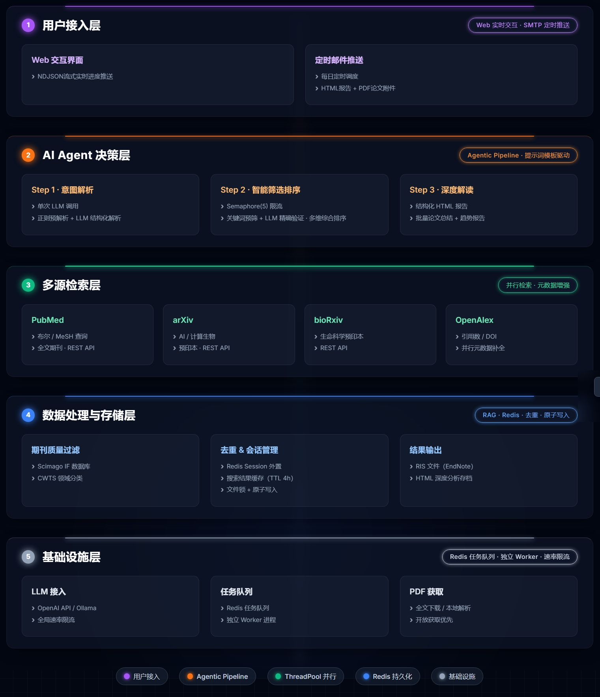

# 文域星图

> 基于 LLM 的生物信息学 & AI 文献智能检索与推送系统

---

## 1. 项目简介 (Project Overview)

### 背景与痛点

在医学、生物信息学、人工智能等前沿科研领域，研究人员每天面临大量新发表的论文。传统的文献检索方式存在以下痛点：

- **多源数据分散**：PubMed、arXiv、bioRxiv 等数据库各自独立，需要逐一检索，无法统一访问
- **检索效率低**：手动构造布尔查询（如 `bioinformatics AND "deep learning"`）门槛高，普通用户难以精准表达检索意图
- **无法自动提炼核心结论**：获取论文列表后，仍需逐篇阅读摘要，无法快速把握研究全貌与趋势
- **手工筛选工作量大**：面对数十甚至上百条检索结果，人工筛选和分类耗时耗力
- **缺乏定期追踪机制**：无法自动跟踪特定研究方向的最新进展，容易遗漏重要论文

### 项目定义

**文域星图** 是一个基于大语言模型（LLM）的文献智能检索与推送系统。用户只需用自然语言描述需求，系统即可自动完成需求解析、多源检索、智能筛选、中文总结和邮件推送的完整流程。

### 核心价值

| 目标 | 实现方式 |
|------|---------|
| **自然语言交互** | 用户无需构造复杂查询，用中文描述需求即可 |
| **多源统一检索** | 一次查询同时搜索 PubMed、arXiv、bioRxiv，自动去重排序 |
| **智能需求解析** | LLM 自动提取关键词、时间范围、过滤条件 |
| **自动中文总结** | 为每篇论文生成中文摘要，并输出整体研究趋势报告 |
| **定时自动推送** | 每日定时检索并推送最新文献到邮箱，零人工干预 |

---

## 2. 核心功能特性 (Features)

### 2.1 智能需求解析

| 功能 | 说明 |
|------|------|
| 自然语言解析 | 支持"帮我找最近3年CRISPR和基因编辑的文献"等自然语言输入 |
| 关键词提取 | LLM 自动提取主题关键词、文章类型关键词，并构建布尔检索式 |
| 时间范围解析 | 支持"最近7天"、"2023-2024年"、"去年"等多种中英文时间表达 |
| 过滤条件提取 | 自动识别影响因子范围、期刊名称、研究领域等过滤条件 |
| 关键词逻辑判断 | LLM 智能判断关键词间使用 AND（交集）还是 OR（并集） |

### 2.2 多源文献检索

| 数据源 | 类型 | 说明 |
|--------|------|------|
| **PubMed** | 生物医学 | NCBI 官方 API，支持精确日期范围和布尔查询 |
| **arXiv** | 预印本 | AI/ML/计算生物学预印本，实时获取 |
| **bioRxiv** | 生物学预印本 | 生物学领域最新研究，抢先于正式发表 |
| **OpenAlex** | 元数据增强 | 补充引用计数、OA 状态、机构信息 |

### 2.3 智能筛选与排序

- **多维度去重**：基于 DOI、arXiv ID、标题相似度三级去重
- **相关性排序**：综合关键词匹配度、发表时间、引用数排序
- **期刊质量过滤**：集成 CWTS 来源分类和 Scimago 影响因子数据
- **领域分类**：基于 RAG 的领域分类器，将论文映射到 CWTS 层级分类体系

### 2.4 LLM 驱动的文献总结

| 总结类型 | 说明 |
|---------|------|
| **整体趋势报告** | 汇总所有论文，提炼研究方向、热点和趋势 |
| **单篇中文摘要** | 为每篇论文生成结构化中文总结（研究目的、方法、发现、意义） |
| **深度分析** | 针对单篇论文进行深度解读，支持交互式追问 |

### 2.5 邮件推送与定时任务

- **HTML 格式邮件**：包含论文卡片、中文总结、趋势报告
- **RIS 格式导出**：支持导出到 EndNote/Zotero 等文献管理工具
- **定时推送**：通过 `schedule` 库实现每日定时检索和推送
- **去重机制**：自动记录已推送论文，避免重复发送

### 2.6 Web 交互界面

- **零依赖前端**：纯 stdlib `http.server` 实现，无需 Flask/Django
- **实时流式响应**：NDJSON 流式推送搜索和分析进度
- **会话管理**：多用户会话隔离，支持并发访问
- **在线配置**：浏览器内配置 LLM API Key、SMTP 邮箱等

---

## 3. 系统架构与技术栈 (Architecture & Tech Stack)

### 3.1 系统架构图



### 3.2 演示

<div align="center">
  <video src="https://ghp.ci/https://raw.githubusercontent.com/ymhHAHA/AI-Literature-Copilot/main/showcase/demo.mp4" controls="controls" width="100%" height="auto"></video>
</div>

### 3.3 技术栈

| 层级 | 技术 | 说明 |
|------|------|------|
| **LLM 接入** | OpenAI SDK | 兼容 OpenAI / 通义千问 / DeepSeek / 本地部署 |
| **文献检索** | Biopython (Entrez) | PubMed API |
| | arxiv Python SDK | arXiv API |
| | requests | bioRxiv / OpenAlex REST API |
| **RAG / 知识库** | OpenAI Embeddings | 领域分类向量检索 |
| | CWTS Classification | 期刊来源层级分类 |
| | Scimago JR | 期刊影响因子数据 |
| **Web 服务** | stdlib http.server | 零依赖 HTTP 服务 |
| | NDJSON Streaming | 实时进度推送 |
| **缓存** | Redis | 搜索结果缓存（TTL 4h） |
| **定时任务** | schedule | 每日定时推送 |
| **部署** | Docker / Docker Compose | 容器化部署 |

---

## 5. 核心技术挑战与解决方案 (Technical Challenges & Showcases)

### 挑战 1：自然语言需求的鲁棒解析

**问题**：用户输入千差万别，如"帮我找最近3年CRISPR和基因编辑的文献，IF>5，发到xxx@xxx.com"，需要同时提取关键词、时间范围、过滤条件和邮箱。

**解决方案**：正则预解析 + LLM 精细解析的双层架构

```
用户输入
   ↓
正则预解析（快速、确定性）
   ├── 时间范围：支持"最近N天/月/年"、"YYYY年"、"去年"等20+种中文时间表达
   ├── 邮箱提取：正则匹配
   └── 影响因子/期刊/领域过滤
   ↓
LLM 精细解析（语义理解）
   ├── 主题关键词提取 & 英文翻译
   ├── 布尔检索式构建
   ├── 关键词逻辑判断（AND/OR）
   └── 正则未命中的模糊时间表达
```

- 正则优先保证速度和确定性，LLM 兜底处理模糊语义
- 关键词有效性校验：过滤无意义词（"的"、"相关"、"文献"等），避免生成无效查询

### 挑战 2：多源检索的去重与排序

**问题**：同一篇论文可能同时出现在 PubMed 和 bioRxiv，且各数据源返回的元数据格式不统一。

**解决方案**：三级去重 + 综合排序

```python
# 去重策略（优先级从高到低）
1. DOI 精确匹配       → 最高优先级
2. arXiv ID 匹配     → 预印本去重
3. 标题相似度匹配     → 兜底去重（Levenshtein 距离）

# 排序策略
综合得分 = 关键词匹配度 × 0.4 + 时效性 × 0.3 + 引用数 × 0.3
```

### 挑战 3：LLM 调用的并发控制与容错

**问题**：为 50 篇论文生成中文摘要时，需要并发调用 LLM API，但面临速率限制和连接不稳定。

**解决方案**：信号量并发控制 + 指数退避重试

```python
# 并发控制
_LLM_SEMAPHORE = threading.BoundedSemaphore(max_concurrent)  # 限制最大并发数

# 重试策略
- 最大重试次数：3 次（可配置）
- 退避策略：指数退避 + 随机抖动（避免雪崩）
- 可重试状态码：408, 429, 500, 502, 503, 504
- 瞬态错误检测：connection error, timeout, rate limit
```

### 挑战 4：零依赖 Web 服务的实时体验

**问题**：文献搜索和 LLM 总结耗时较长（30s-3min），传统 HTTP 请求会超时，用户体验差。

**解决方案**：NDJSON 流式推送

```
客户端请求 → 服务端启动后台线程
         ← {"type":"progress","step":"searching","message":"正在检索 PubMed..."}
         ← {"type":"progress","step":"summarizing","message":"正在生成总结 3/20..."}
         ← {"type":"result","data":{...}}
         ← {"type":"done"}
```

- 使用 `Thread + Queue` 模式，后台线程执行耗时任务，主线程实时推送进度
- 无需 WebSocket，兼容所有浏览器

### 挑战 5：领域知识增强检索质量

**问题**：纯关键词匹配无法区分"cell"在"cell biology"和"cell phone"中的含义，检索结果噪声大。

**解决方案**：RAG 领域分类器 + CWTS 期刊来源过滤

```
用户查询
   ↓
RAGFieldClassifier（向量检索）
   ├── 加载 CWTS 层级分类体系（Micro/Meso/Macro）
   ├── 计算查询与领域的语义相似度
   └── 返回最相关的研究领域
   ↓
CWTSSourceFilter（期刊过滤）
   ├── 识别论文来源期刊的 CWTS 分类
   └── 过滤掉不属于目标领域的期刊
   ↓
ScimagoMetrics（影响因子）
   └── 补充期刊影响因子，支持 IF 范围过滤
```

---


